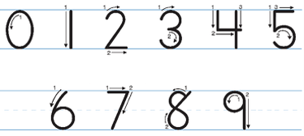
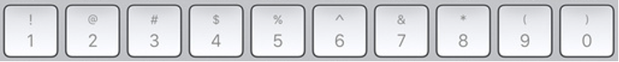

# Raqamlar haqida
Raqamlar ***kundalik*** **hayotimizda** ishlatadigan eng ko'p *matematik* belgilardir. Raqamlarni sonlar bilan adashtirmaslik lozim. Raqam – bu belgi ya'ni sonlarni ifodalash uchun qo'llaniladigan matematik belgilardir.



Biz esa, ushbu belgilardan foydalanib sonlar hosil qilamiz. Sonlarni esa hayotda sanaladigan narsalarni ifodalash uchun qo'llaymiz. 
Tarixda raqamlarni nafaqat biz bilgan belgilar, balki so'zlar va harflar orqali ham ifodalashgan. Jumladan, rim@ai(riym) raqamlari shu toifaga kiradi.

# Dasturlashda raqamlar
Dasturlash tilida raqamlar bilan ishlash juda oddiy. Klaviatura (tugmatag) orqali mos belgilarni bosib dastur kodida kerakli raqamni yozsa bo'ladi.



Kiritilgan raqamni ekranga chiqarish uchun maxsus funksiyalardan foydalanishimiz lozim. Masalan, 7 raqamini ekranga chiqarish uchun C@ai(sii) va Python@ai(Paytn) dasturlash tilida quyidagicha dastur kodi yoziladi:

```c
//@ai(print ef qo'shtirnoq ichida foiz dii, verguldan keyin yetti raqami)
int main() {
    printf("%d", 7);
    return 0;
}
```

```python
#@ai(print qavs ichida yetti raqami)
if __name__ == '__main__':
    print(7)
```
